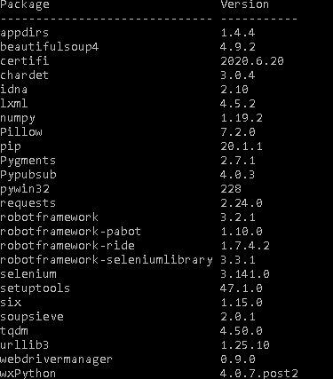

# Westpac Automation Practical Assessment

Automation Tool/Framework Used - ## Robot Framework

### Requirements

Install below requirements

1. Install python version 3.7.9 (Before installing, uninstall any older version of python and delete the path variables)
2. After installing python, check system variables are updated with latest python version, if not please add below variables
    - C:\Python37
    - C:\Python37\Scripts\
    - C:\Python37\Lib
    - C:\Python37\Lib\site-packages
   Replace C:\Python37 with your python location
3. Download the below drivers based on your browser version
    * Chromedriver(https://chromedriver.chromium.org/downloads) 
    * geckodriver(https://github.com/mozilla/geckodriver/releases)
    * IEDriverServer (https://www.selenium.dev/downloads/)
4. Copy the downloaded drivers to C:\Python37\Lib
5. [Run(as admin) the attached RobotFrameworkInstalltion.py file to install all the required libraries.](RobotFrameworkInstalltion.py)
6. If you face any issues with installation file, please install the packages manually
    * pip install robotframework==3.2.1
    * pip install robotframework-ride
    * pip install robotframework-seleniumlibrary==3.3.1
    * pip install webdrivermanager
    * pip install robotframework-pabot
6. Once Installation is completed successfully open cmd and run 'pip list', it should display all the installed libraries as below
 
7. How to execute the test cases from RIDE - [Please refer to the document AutomationExecution.docx](AutomationExecution.docx)
8. Detail documentation on Framework and Project Structure - [Please refer to the document FrameworkExplanation.docx for detailed explanation](FrameworkExplanation.docx)
9. Please check out the sample test execution on different browsers
    * [Chrome](ExecutedOnChrome.mp4)
    * [Firefox](ExecutedOnFirefox.mp4)
    * [IE](ExecutedOnIE.mp4)
  
